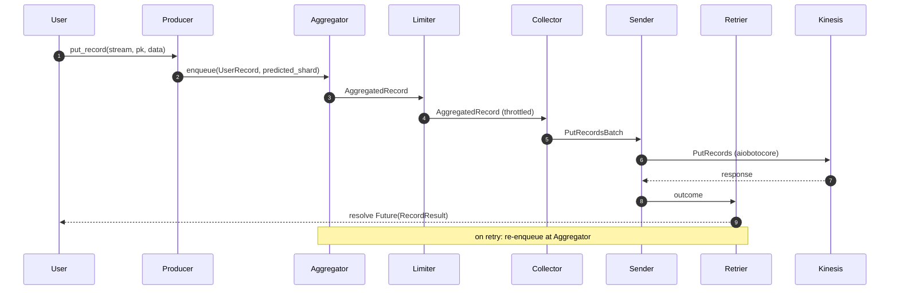

# Architecture

`aiokpl` implements the same pipeline as the C++ KPL, on top of an `anyio`
task group so the same code runs on both the asyncio and trio runtimes. The
shape is:

```
UserRecord
   │  producer.put_record()
   ▼
Aggregator   ──► AggregatedRecord  (per predicted shard, deadline-driven)
   ▼
Limiter      ──► throttled to 1000 rec/s + 1 MiB/s per shard
   ▼
Collector    ──► PutRecordsBatch   (500 records / 5 MiB / 256 KiB-per-shard)
   ▼
Sender       ──► aiobotocore.put_records (async)
   ▼
Retrier      ──► classify outcome (throttle / transient / wrong-shard / expired)
   ▼
finish_user_record  →  resolves the user's awaitable future
```

For the migration mapping from the C++ KPL Java sidecar to the `aiokpl`
public API, see [Migrating from the KPL Java sidecar](why.md#migrating-from-the-kpl-java-sidecar).

## Stages

### Aggregator

Groups `UserRecord`s into `AggregatedRecord`s **by predicted shard**. Each
predicted shard has its own per-shard batch with its own deadline. When the
batch's deadline fires, or its size approaches the aggregation limit, the
batch closes and is handed downstream. When the `ShardMap` is not READY,
the aggregator falls back to single-record mode (one `AggregatedRecord` per
`UserRecord`) so the pipeline degrades gracefully.

### Limiter

Per-shard token-bucket rate limiter. Two streams per bucket — one for
records (1000/s) and one for bytes (1 MiB/s) — matching the Kinesis hard
limits. The bucket is **query-on-demand**: tokens are computed from
`now - last_refill`, no background thread, no `sleep`. Records that exceed
the budget wait in a per-shard queue drained every 25 ms by a single
background task.

### Collector

Reducer over `(AggregatedRecord, PutRecordsBatch)`. Closes a batch on any
of: 500 records, 5 MiB total, 256 KiB on any single predicted shard, or
the earliest record's deadline. The 256 KiB-per-shard short-circuit is a
Kinesis quirk — beyond it, `PutRecords` will start throttling individual
records — and it is the only place where the collector cares about shard
identity.

### Sender

Glue to `aiobotocore.client.put_records`. Builds `PutRecordsRequestEntry`
items, sets the right partition key and explicit hash key for aggregated
vs single records, and submits asynchronously. Its `done_callback` does
not call the retrier directly; it enqueues an internal item that the
retrier task pulls. (This mirrors `pipeline.h:206` in the C++ source — do
not hammer downstream from SDK callback threads.)

### Retrier

The most important code in the library. For each per-record result inside
the `PutRecords` response, the retrier classifies the outcome and decides
the next step:

| Outcome | Action |
|---|---|
| Success, predicted shard matches actual | `finish(success)` |
| Success, actual shard contains the hash (split-child) | `finish(success)` + `ShardMap.invalidate` |
| Success, actual shard does NOT contain the hash | `retry("Wrong Shard")` + `ShardMap.invalidate` |
| Error `ProvisionedThroughputExceededException` + `fail_if_throttled=True` | `fail` |
| Error `ProvisionedThroughputExceededException` + `fail_if_throttled=False` | `retry_not_expired` |
| Other error | `retry_not_expired` |

`retry_not_expired` checks `clock() - arrival_time > record_ttl_ms` —
expired records `fail("Expired")`, otherwise the record is re-enqueued
with a fresh deadline. See [Phase 5 — Sender + Retrier](phases/phase-5-sender-retrier.md)
for the implementation walkthrough. On terminal outcomes (`finish` or
`fail`), the retrier resolves the user's awaitable future with a
`RecordResult` carrying the full attempt history.

## Sequence



The full loop matters: on retry, a record goes **back to the aggregator**,
not back to the limiter. The predicted shard may have changed since the
last attempt (if the shard map was invalidated), and we want the next
attempt to be batched with whoever is currently going to the same shard.
