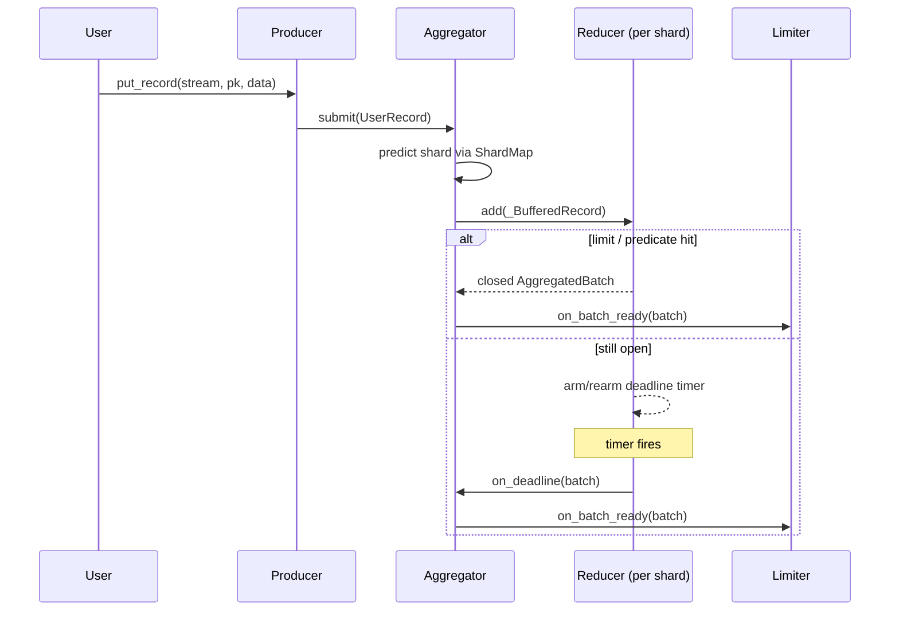

# Phase 3 — Batching (Reducer / Aggregator / Collector)

**Status:** Done.

Phase 3 is where the producer earns its keep. The Sender and Retrier
glue around it are mechanical; the batching stages are where every
philosophical bullet in the README turns into running code:
**deadlines drive flushes, the shard is the unit of optimization, each
stage owns one responsibility.**

## Why three stages, not one

A naïve producer interleaves two unrelated jobs into a single batcher:
"group user records into a single aggregated payload" and "group
aggregated payloads into a `PutRecords` call". The C++ KPL deliberately
separates them, and so does aiokpl, because their constraints are
different:

| Stage | Input | Output | Hard limits | Why the split |
|---|---|---|---|---|
| Aggregator | `UserRecord` | `AggregatedRecord` per shard | 4 294 967 295 records, 51 200 B | One predicted shard's payload — sharing the wire-format dedup tables. |
| Collector | `AggregatedRecord` | `PutRecordsBatch` | 500 records, 5 MiB total, 256 KiB per shard | One Kinesis API call — independent of shard identity. |
| Reducer | generic `(item, batch)` | closed batch | caller-supplied | The deadline-driven mechanism reused by both. |

The Aggregator can never produce a batch that exceeds a shard's share
of the API call (it would violate Kinesis's per-shard throughput
ceiling). The Collector can never know the wire-format dedup tables (it
sees opaque `AggregatedRecord`s). Splitting them is what makes each
stage a hundred-line file with a single test surface.

## Reducer's contract

[`aiokpl.reducer.Reducer`](../reference/aiokpl/reducer.md) is the
generic batcher both higher stages stand on. Its contract:

- **Deadline-driven.** Every batchable item exposes a monotonic
  `deadline: float`. The Reducer reprograms an `anyio` timer to the
  current batch's earliest deadline on every `add`; when the timer
  fires, the batch is closed and handed to `on_deadline`.
- **FIFO-by-deadline packing.** When a hard limit (count or size) is hit
  or the optional `flush_predicate` fires, the Reducer closes the
  current batch *and* packs whatever it can FIFO-by-deadline. Excess
  items are re-injected into a fresh active batch — never dropped.
- **Hard limits use `>=` semantics.** `count >= count_limit` or
  `size >= size_limit` triggers a synchronous return from `add`. This
  matches the C++ KPL behaviour and keeps a batch that exactly meets
  the limit from sitting on the timer.
- **Cancellation-safe.** Each timer lives in a per-timer
  `anyio.CancelScope`; reschedules cancel the previous scope without
  taking down siblings.
- **Single-item-too-big.** If one item alone exceeds the limits, the
  Reducer surfaces it as a one-item closed batch rather than silently
  dropping. Downstream (Kinesis) will reject with a clear error.

Cross-reference: `aws/kinesis/core/reducer.h` and
`aws/kinesis/core/reducer.cc` in the C++ KPL.

## Aggregator

[`aiokpl.aggregator.Aggregator`](../reference/aiokpl/aggregator.md)
owns one `Reducer[_BufferedRecord, AggregatedBatch]` per predicted
shard. The lookup is a `dict[int | None, Reducer]` guarded by an
`anyio.Lock`; creation is lazy on first `put`.

- **Routing.** `submit(user_record)` computes the hash key
  (`md5_hash_key(partition_key)` or `parse_explicit_hash_key`) and asks
  the injected `ShardMap` for the predicted shard. The buffered record
  is routed to that shard's reducer.
- **Single-record fallback.** When the `ShardMap` is not `READY` (or
  returns `None` for the hash key), the record routes to a catch-all
  `None`-shard reducer in single-record mode (`count_limit=1` —
  every record flushes as its own batch). The same path is taken when
  `aggregation_enabled=False`. This is what keeps the pipeline flowing
  on cold start before the first `ListShards` returns.
- **Size estimation.** Each `AggregatedBatch` maintains a monotonic
  running total of proto framing overhead plus deduped partition-key
  and explicit-hash-key references. The exact byte count is computed
  only at `to_blob()` time. Mirrors the
  `accurate_size`/`estimated_size` distinction in
  `aws/kinesis/core/kinesis_record.cc`.
- **Retry re-entry.** `put_buffered(buffered)` is the Retrier's
  re-injection point. The buffered record keeps its accumulated
  `Attempt` history and original `arrival_time`; the predicted shard
  may differ from the previous attempt because the cached `ShardMap`
  may have refreshed in between.

Cross-reference: `aws/kinesis/core/aggregator.h`.

## Collector

[`aiokpl.collector.Collector`](../reference/aiokpl/collector.md) is a
single `Reducer[AggregatedBatch, PutRecordsBatch]` with three closure
triggers:

- **500 records.** Kinesis's `PutRecords` cap.
- **5 MiB total.** Kinesis's per-call payload cap.
- **256 KiB per shard short-circuit.** When any single shard's share of
  the in-flight `PutRecordsBatch` reaches 256 KiB, the batch is closed
  immediately even if the global caps are nowhere near. This is the
  per-shard latency guard: a hot shard cannot starve the rest of the
  batch by piling up bytes while the timer ticks.

The 256 KiB threshold is enforced via the Reducer's `flush_predicate`
hook — the predicate sees the just-added item and the current batch and
returns `True` when `current.per_shard_bytes(item.predicted_shard) >=
256 KiB`. Cross-reference: `aws/kinesis/core/collector.h`.

## End-to-end shape

The same shape repeats one stage down: the Collector wraps a single
Reducer whose input is `AggregatedBatch` and whose output is
`PutRecordsBatch`. The Reducer code is reused verbatim — only the
container type and the flush predicate change.

## Testing surface

- **Unit.** Reducer deadline ordering under sustained `add`s,
  FIFO-by-deadline pack fairness on `flush`, single-item-too-big edge,
  cancellation under shutdown. All run on both `asyncio` and `trio` via
  the parametrised `anyio_backend` fixture.
- **Aggregator.** Per-shard routing correctness, single-record fallback
  when the `ShardMap` is not `READY`, dedup-table accounting on the
  size estimator.
- **Collector.** 256 KiB short-circuit, 5 MiB cap, 500-record cap, all
  three intersecting on the same input stream.
- **Integration.** Phase 6's `tests/integration/test_producer_integration.py`
  drives end-to-end against `etspaceman/kinesis-mock` with 100
  random-partition-key records — exercises Aggregator and Collector in
  the same task tree as every other stage.
